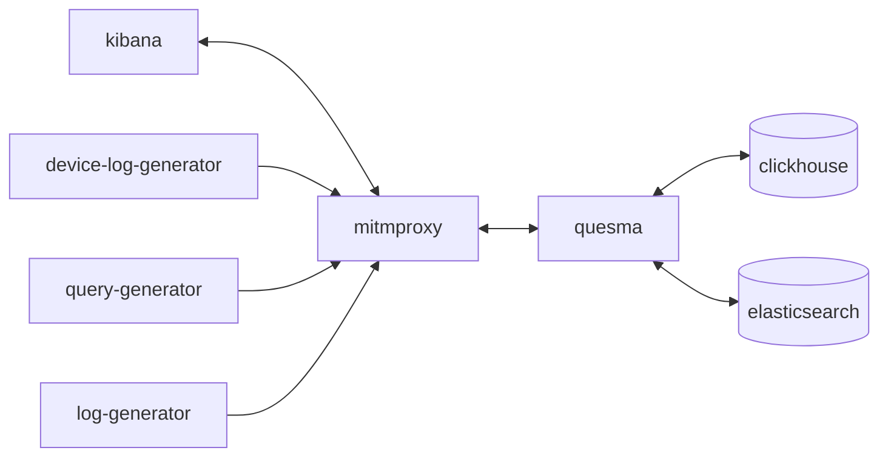

# MVP of Quesma using ELK stack with Clickhouse

Minimal Viable Product of Quesma. It provides Elasticsearch API compatibility for observability use case
with Clickhouse as a backend.

Main debugging interface is available at [localhost:9999](http://localhost:9999). You can follow links.

## Architecture



### Kibana

Kibana is available at [localhost:5601](http://localhost:5601/app/observability-log-explorer/).

### MITM Proxy
Mitmweb is available at [localhost:8081](http://localhost:8081).

It is a man in the middle inspection tool, please [consult the mitmproxy documentation](https://docs.mitmproxy.org/stable/).

You can enable Python script by uncommenting `docker-compose.yml` in `services.mitmproxy.run`.

You can further edit it `mitmproxy/request.py`.

Very useful for quick dumps in `mitmproxy/requests`:
```bash
tail -f mitmproxy/requests/logs-X-X.txt
```

Some filters that you might find useful for filtering out noise requests (copy paste into the `Search` box):
```bash

!/_doc & !security & !metrics & !.kibana_alerting & !_nodes &!kibana_task_manager & !_pit & !_monitoring & !_xpack & !.reporting & !.kibana & !heartbeat & !_aliases & !_field_caps & !_license & !.logs-endpoint & !.fleet- & !traces & !_cluster & !_resolve & !_mapping & !logs-cloud & !.monitoring & !.ds-risk
```
This will also filter out insert requests:
```bash
!/_doc & !security & !metrics & !.kibana_alerting & !_nodes &!kibana_task_manager & !_pit & !_monitoring & !_xpack & !.reporting & !.kibana & !heartbeat & !_aliases & !_field_caps & !_license & !.logs-endpoint & !.fleet- & !traces & !_cluster & !_resolve & !_mapping & !logs-cloud & !.monitoring & !.ds-risk & !_bulk
```

### Clickhouse-client
To connect to the client when `clickhouse-server` is running on [localhost:8123/play](http://localhost:8123/play)

Alternatively you can find container name using `docker ps` and use command line:

```bash
docker exec -it poc-elk-mitmproxy-clickhouse-1 clickhouse-client
```

Once you connected you run typical SQL commands such as:
```sql
SHOW TABLES;
DESCRIBE logs;
SELECT * FROM logs LIMIT 10;
```
