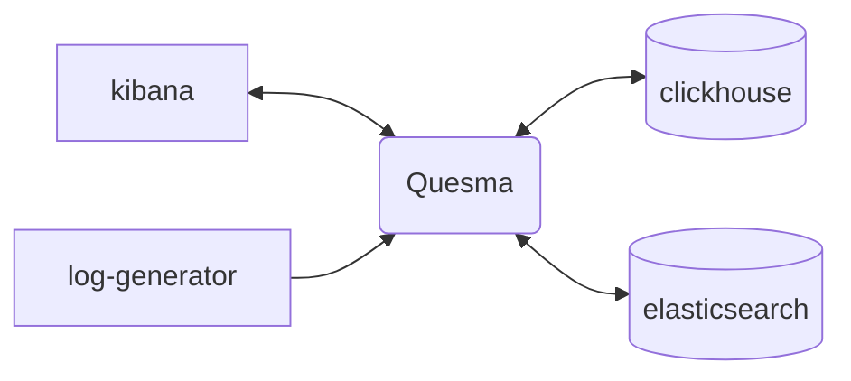

<p align="center">
<a href="https://www.quesma.com"></a>
</p>

<p align="center">
<a href="https://github.com/QuesmaOrg/quesma/actions/workflows/pipeline.yml"></a>
<a href="https://img.shields.io/github/v/release/QuesmaOrg/quesma"></a>
<a href=""></a>
<a href=""></a>
<a href="https://goreportcard.com/report/github.com/QuesmaOrg/quesma"></a>
</p>

<p align="center">
<a href="https://www.quesma.com">Website</a> | 
<a href="https://www.linkedin.com/company/quesma">LinkedIn</a> | 
<a href="https://twitter.com/QuesmaOrg">Twitter</a> | 
<a href="https://www.youtube.com/@QuesmaOrg">YouTube</a> | 
<a href="https://docs.quesma.com/eap-docs">Docs</a>
</p>

Quesma is an actively developed database gateway currently in pre-alpha Early Access. Route your queries through a translation layer that seamlessly connects your apps with the modern database platforms of your choice. No more query refactoring during migrations.

How? Isn't migrating to a new database hard? Quesma does it without touching your application/client stack - keeping backward compatibility and moving safely, step-by-step. We translate your queries so you don’t have to rewrite your database query code during migrations.

<p align="center">
<a href=""></a>
</p>


Currently supported: Quesma makes it possible to connect seamlessly [**Kibana/OpenSearch Dashboards to Clickhouse**](https://quesma.com/quesma-for-elk)

## Getting Started

The easiest way to get started is to try out the example `docker-compose` setup, which can be found in `/examples/kibana-sample-data.` It features Kibana connecting to Elasticsearch and Clickhouse through Quesma:



The setup contains following demo datasets:
- `logs-generic-default` - generated by `log-generator` application
    - Logs Explorer: [link](http://localhost:5601/app/observability-log-explorer)
- `kibana_sample_data_ecommerce` - an official Kibana sample data set
    - Logs Explorer: [link](<http://localhost:5601/app/discover#/?_a=(columns:!(),filters:!(),index:ff959d40-b880-11e8-a6d9-e546fe2bba5f,interval:auto,query:(language:kuery,query:''),sort:!(!(order_date,desc)))&_g=(filters:!(),refreshInterval:(pause:!t,value:60000),time:(from:now-30d%2Fd,to:now))>)
    - Dashboard: [link](<http://localhost:5601/app/dashboards#/view/722b74f0-b882-11e8-a6d9-e546fe2bba5f?_g=(filters:!(),refreshInterval:(pause:!t,value:0),time:(from:now-7d,to:now))>)
- `kibana_sample_data_flights` - an official Kibana sample data set
    - Logs Explorer: [link](<http://localhost:5601/app/discover#/?_a=(columns:!(),filters:!(),index:d3d7af60-4c81-11e8-b3d7-01146121b73d,interval:auto,query:(language:kuery,query:''),sort:!(!(timestamp,desc)))&_g=(filters:!(),refreshInterval:(pause:!t,value:60000),time:(from:now-30d%2Fd,to:now))>)
    - Dashboard: [link](<http://localhost:5601/app/dashboards#/view/7adfa750-4c81-11e8-b3d7-01146121b73d?_g=(filters:!(),refreshInterval:(pause:!t,value:0),time:(from:now-7d,to:now))>)

### Running the example
In order to run it, you need to:
- clone this repository: `git clone https://github.com/QuesmaOrg/quesma.git`
- run `docker-compose up` directly from `examples/kibana-sample-data` directory

Handy one-liner for above commands:
```bash
git clone https://github.com/QuesmaOrg/quesma.git && docker compose -f quesma/examples/kibana-sample-data/docker-compose.yml up
```

The example above uses the latest Quesma Docker image published in DockerHub. In case you want to build Quesma Docker image from the sources, run `./bin/build-image.sh` from the root directory


Once it's running, you can access:
- Kibana at [localhost:5601](http://localhost:5601/)
- Quesma at [localhost:9999](http://localhost:9999/)
- Clickhouse at [localhost:8123/play](http://localhost:8123/play)

### Development

Developer documentation is available in the [docs](docs/dev/DEVELOPMENT.MD) directory.

### License
[Elastic License 2.0](https://github.com/QuesmaOrg/quesma/blob/main/LICENSE.MD)
