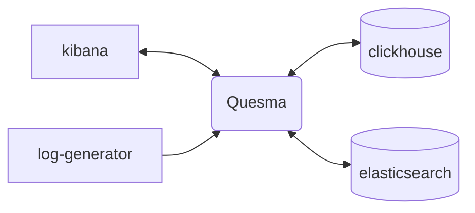
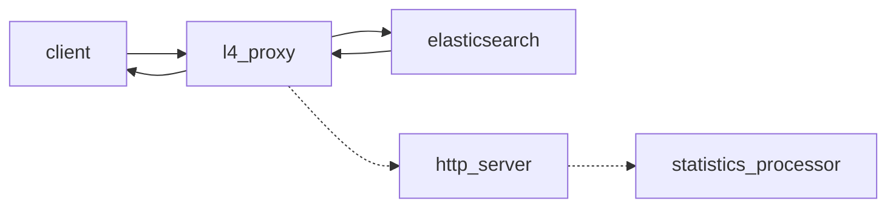
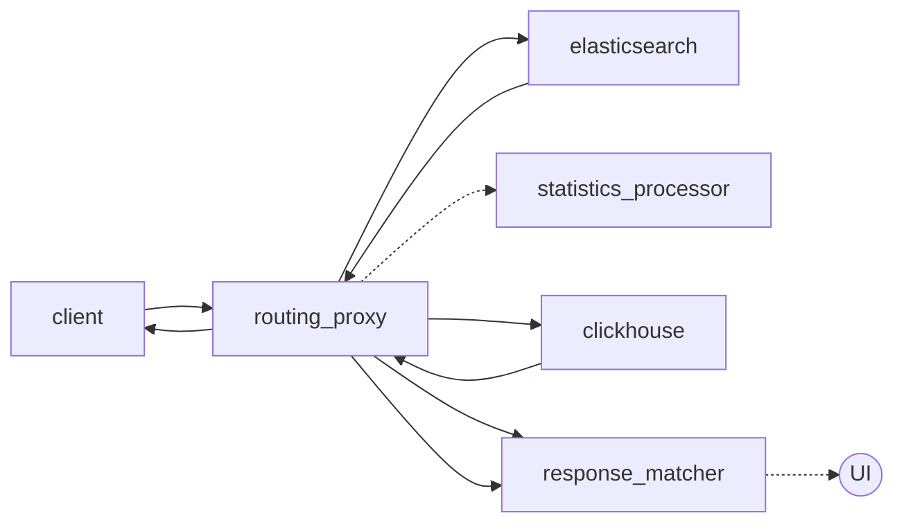
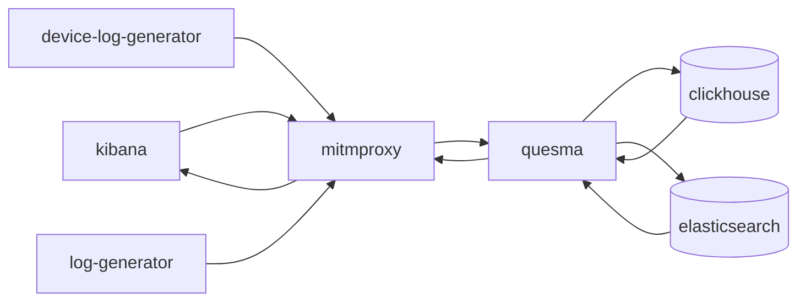

- Website: www.quesma.com
- LinkedIn: https://www.linkedin.com/company/quesma
- X/Twitter https://twitter.com/QuesmaOrg
- YouTube: https://www.youtube.com/@QuesmaOrg
- Documentation: https://eap.quesma.com/eap-docs

Quesma is an actively developed database gateway currently in pre-alpha Early Access. Route your queries through a translation layer that seamlessly connects your apps with the modern database platforms of your choice. No more query refactoring during migrations. How? Isn't migrating to a new database hard? Quesma does it without touching your application/client stack - keeping backward compatibility and moving safely, step-by-step. We translate your queries so you don’t have to rewrite your database query code during migrations.


Currently supported: Quesma makes it possible to connect seamlessly [**Kibana/OpenSearch Dashboards to Clickhouse**](https://quesma.com/quesma-for-elk)

## Getting Started

The easiest way to get started is to try out the example `docker-compose` setup, which can be found in `/examples/kibana-sample-data.` It features Kibana connecting to Elasticsearch and Clickhouse through Quesma:



The setup contains following demo datasets:
- `logs-generic-default` - generated by `log-generator` application
    - Logs Explorer: [link](http://localhost:5601/app/observability-log-explorer)
- `kibana_sample_data_ecommerce` - an official Kibana sample data set
    - Logs Explorer: [link](<http://localhost:5601/app/discover#/?_a=(columns:!(),filters:!(),index:ff959d40-b880-11e8-a6d9-e546fe2bba5f,interval:auto,query:(language:kuery,query:''),sort:!(!(order_date,desc)))&_g=(filters:!(),refreshInterval:(pause:!t,value:60000),time:(from:now-30d%2Fd,to:now))>)
    - Dashboard: [link](<http://localhost:5601/app/dashboards#/view/722b74f0-b882-11e8-a6d9-e546fe2bba5f?_g=(filters:!(),refreshInterval:(pause:!t,value:0),time:(from:now-7d,to:now))>)
- `kibana_sample_data_flights` - an official Kibana sample data set
    - Logs Explorer: [link](<http://localhost:5601/app/discover#/?_a=(columns:!(),filters:!(),index:d3d7af60-4c81-11e8-b3d7-01146121b73d,interval:auto,query:(language:kuery,query:''),sort:!(!(timestamp,desc)))&_g=(filters:!(),refreshInterval:(pause:!t,value:60000),time:(from:now-30d%2Fd,to:now))>)
    - Dashboard: [link](<http://localhost:5601/app/dashboards#/view/7adfa750-4c81-11e8-b3d7-01146121b73d?_g=(filters:!(),refreshInterval:(pause:!t,value:0),time:(from:now-7d,to:now))>)
- `kibana_sample_data_logs` - an official Kibana sample data set
    - Logs Explorer: [link](<http://localhost:5601/app/discover#/?_a=(columns:!(),filters:!(),index:'90943e30-9a47-11e8-b64d-95841ca0b247',interval:auto,query:(language:kuery,query:''),sort:!(!(timestamp,desc)))&_g=(filters:!(),refreshInterval:(pause:!t,value:60000),time:(from:now-30d%2Fd,to:now))>)
    - Dashboard: [link](<http://localhost:5601/app/dashboards#/view/edf84fe0-e1a0-11e7-b6d5-4dc382ef7f5b?_g=(filters:!(),refreshInterval:(pause:!f,value:900000),time:(from:now-7d%2Fd,to:now))>)

### Running the example
In order to run it, you need to:
- clone this repository: `git clone git@github.com:QuesmaOrg/quesma.git`
- build `quesma:latest` image by running `docker build -f quesma/Dockerfile -t quesma:latest quesma` from the root directory
- run `docker-compose up` directly from `/examples/kibana-sample-data` directory

Once it's running, you can access:
- Kibana at [localhost:5601](http://localhost:5601/)
- Quesma at [localhost:9999](http://localhost:9999/)
- Clickhouse at [localhost:8123](http://localhost:8123/)

# Development

## Architecture

### Architecture Decision Records

https://github.com/QuesmaOrg/poc-elk-mitmproxy/tree/main/adr

### Quesma

#### L4 Proxy



#### Dual-Write



### Docker Compose Setup (`local-dev`)



### Kibana

Kibana is available at [localhost:5601](http://localhost:5601/app/observability-log-explorer/).

### MITM Proxy
Mitmweb is available at [localhost:8081](http://localhost:8081).

It is a man in the middle inspection tool, please [consult the mitmproxy documentation](https://docs.mitmproxy.org/stable/).

You can enable the Python script by uncommenting `docker-compose.yml` in `services.mitmproxy.run`.

You can further edit it `mitmproxy/request.py`.

Very useful for quick dumps in `mitmproxy/requests`:
```bash
tail -f mitmproxy/requests/logs-X-X.txt
```

Some filters that you might find useful for filtering out noise requests (copy-paste into the `Search` box):
```bash

!/_doc & !security & !metrics & !.kibana_alerting & !_nodes &!kibana_task_manager & !_pit & !_monitoring & !_xpack & !.reporting & !.kibana & !heartbeat & !_aliases & !_field_caps & !_license & !.logs-endpoint & !.fleet- & !traces & !_cluster & !_resolve & !_mapping & !logs-cloud & !.monitoring & !.ds-risk
```
This will also filter out insert requests:
```bash
!/_doc & !security & !metrics & !.kibana_alerting & !_nodes &!kibana_task_manager & !_pit & !_monitoring & !_xpack & !.reporting & !.kibana & !heartbeat & !_aliases & !_field_caps & !_license & !.logs-endpoint & !.fleet- & !traces & !_cluster & !_resolve & !_mapping & !logs-cloud & !.monitoring & !.ds-risk & !_bulk
```

### Memory Profiling
Container-friendly _pprof_ endpoint is exposed at [localhost:9999/debug/pprof/](http://localhost:9999/debug/pprof/)

#### Fetch a memory profile

```bash
curl http://localhost:9999/debug/pprof/heap > heap.out
go tool pprof -http=:8082 heap.out 
````

Now, head over to localhost:8082 and you can inspect the memory profile

### Clickhouse-client
To connect to the client when `clickhouse-server` is running on [localhost:8123/play](http://localhost:8123/play)

Alternatively, you can find the container name using `docker ps` and use the command line:

```bash
docker exec -it poc-elk-mitmproxy-clickhouse-1 clickhouse-client
```

Once you connected, you run typical SQL commands such as:
```sql
SHOW TABLES;
DESCRIBE logs;
SELECT * FROM logs LIMIT 10;
```


### Running locally with debugger

It's possible to run Quesma from IDE with a debugger. For that, you need to start the auxiliary services with the `local-debug.yml` file,
which provides a minimal set of dependencies - Elasticsearch, Clickhouse, and Kibana with sample data sets.

1. Change the name of the `config.yaml.template` file to `config.yaml` or create a new one and copy the content from the template.
2. Navigate to `quesma/main.go` and click `Run application` menu in your IDE. Optionally, you can also run the `main.go` file from the command line.
3. Start auxiliary services with the following command:
    ```bash
    HOST_IP=$(ifconfig en0 | awk '/inet / {print $2}') docker-compose -f docker/local-debug.yml up
    ```
   This is minimalistic setup with `Elasticsearch`, `ClickHouse`, and `Kibana` populated with sample data sets.
   There's also `MITM proxy` to help you inspect the actual traffic.

   **NOTE:** Since we're all using Mac's, Docker daemon cannot use `host` network mode. The only option for processes running
   in containers to connect locally running Quesma process is to pass the IP address like this.
4. If you set proper breakpoints in your IDE, you should see the execution stopped at the breakpoint.
5. Profit!

### License
[Elastic License 2.0](https://github.com/QuesmaOrg/quesma/blob/main/LICENSE.MD)
