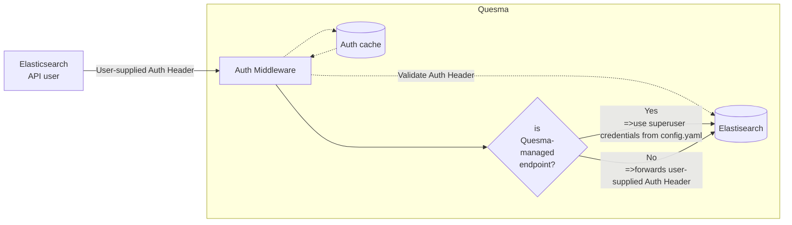

# Relying on Elasticsearch for authentication

## Context and Problem Statement

**Context:** As for today (Sept, 29th 2024), Quesma can connect to both ClickHouse and Elasticsearch instances which are protected with user credentials (username and password). However, the Elasticsearch REST API Quesma exposes on port 8080 is not protected at all. Basically, it exposes all the data living in ClickHouse and Elasticsearch to unauthenticated parties.

When exposing Elasticsearch API (which Kibana is a client of) we are required to be compliant with its authn/authz logic. All the related security data (user credentials, roles, permissions…) live in **Elasticsearch**. While Kibana might internal store only session related data, but it always defers to Elasticsearch with the security claims. Below are some helpful resources to get better understanding of Elasticsearch auth:

- https://www.elastic.co/blog/demystifying-authentication-and-authorization-in-elasticsearch
- https://www.elastic.co/blog/a-deep-dive-into-elasticsearch-authentication-realms

Especially the 2nd one is more interesting for us.

**Note 1:** some of the Elasticsearch auth realms like SAML or OIDC are meant solely for Kibana, not for the ES API.
**Note 2:** Native/file realms are used implicitly only unless no others are defined. In case they are, users need to add them explicitly as well.

In order to be compatible with the API, Quesma needs to validate `Authorization` headers for incoming requests.
Elasticsearch exposes an endpoint for this purpose: `/_security/_authenticate`. Example call:
<details>

```
curl -k -H "Authorization: Basic AUTH_HEADER" "https://192.168.0.94:9200/_security/_authenticate" | jq .
{
  "username": "elastic",
  "roles": [
    "superuser"
  ],
  "full_name": null,
  "email": null,
  "metadata": {
    "_reserved": true
  },
  "enabled": true,
  "authentication_realm": {
    "name": "reserved",
    "type": "reserved"
  },
  "lookup_realm": {
    "name": "reserved",
    "type": "reserved"
  },
  "authentication_type": "realm"
}
```
</details>

#### Achieving the API compatibility vs user meeting user requirements

There are 4 possible scenarios/customer expectations we may face:

1. BYOA - existing user base in Elasticsearch
   Quesma defers to Elasticsearch for user authentication.
2. BYOA - existing user base in **target** database (ClickHouse/Hydrolix)
   Quesma has to map whole Elasticsearch `_security` API to accommodate for ClickHouse user base and permission scheme.
3. I don’t have any auth, but I don’t want Quesma to expose data (a.k.a. YOU give me some credentials)
   We simply do basic auth at Quesma level.
4. I’m good with unauthorized API access (perhaps just for the evaluation purposes)

#### Non-negotiable’s for Quesma auth solution

1. Require authentication for **all** endpoints, regardless whether Quesma-controlled or passed to Elasticsearch ( **⇒ Quesma does not expose any data publicly**)
2. Be compliant with Elasticsearch auth mechanics
   **WARNING:** this might have limited scope (e.g. no SAML or PKI, only native realm)
3. Allow any existing Elastic user to authenticate (e.g. `kibana_system`)


## Considered Options

At this point, all the options do not consider interfering with RBAC or any Elasticsearch-internal endpoints. 
Additionally, the final ES call is still made with Quesma-superuser credentials (even for the bypassed requests).

1. **Adding basic auth unrelated to Elasticsearch.**
   With this approach, we could add a set of users managed by Quesma to protect Quesma-handled endpoints (e.g. `/index_in_clickhouse/_field_caps`). However, these users would not be able to use Kibana (Kibana would validate them using Elastic's `_security/authenticate` endpoint and fail). 
   Additionally, the final ES call is still made with Quesma-superuser credentials (even for the bypassed requests).
   In this option, we'd still have to validate incoming requests from **existing** Elastic users.
2. **Delegate authentication completely to Elasticsearch.**
   In this scenario, Quesma takes an incoming request and validates it against Elasticsearch's `_security/authenticate` endpoint.
   To avoid excessive blocking on that process, we should consider building a cache for auth headers (Elasticsearch is very liberal here—the default sessions typically last ~20 minutes).

## Decision Outcome and Drivers

Chosen option: **2.**

Decision drivers:
* Compliance with existing Elasticsearch authn - after putting Quesma before Elasticsearch, there will be no need for additional setup.
* Simplicity in implementation
* Minimal Elasticsearch instance is required for Quesma to work anyway, so we're not putting any additional burden on the user.

Limitations:
* When accessing Quesma-managed endpoints, there's no notion of RBAC - there's no way to restrict access to specific endpoints based on users/their roles. **Therefore, anyone who can authenticate to Elasticsearch is able to access all Quesma-managed endpoints.**
* PKI realm is not supported

**Note:** SAML realm needs to be handled separately - while we just pass `Authorization` headers of all kinds it **should** work, there might be some gotchas which require more testing. For now, it's not a case.

Authentication logic will look as follows:


## People
- @mieciu
