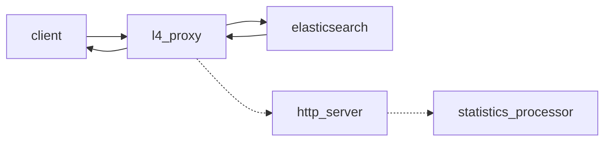
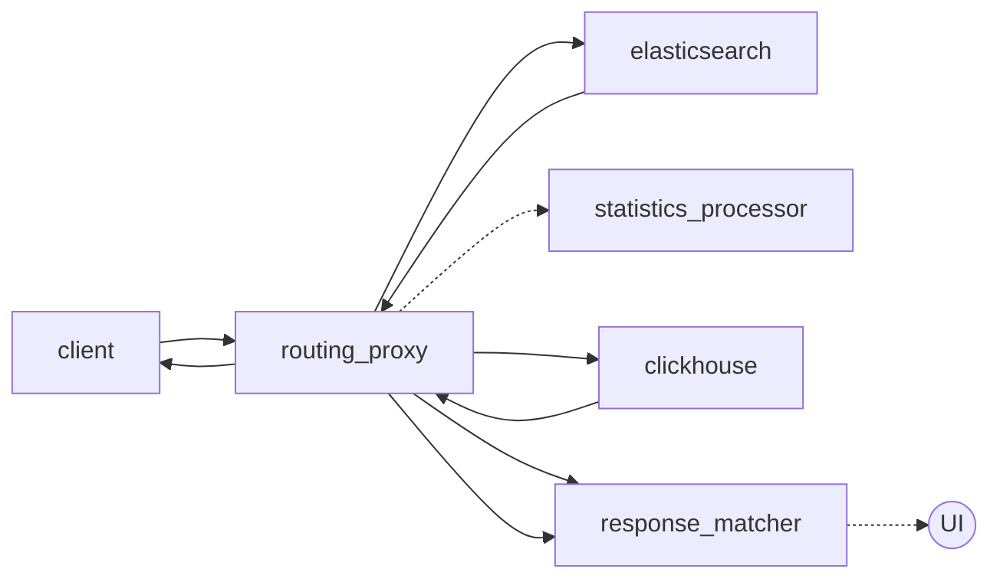
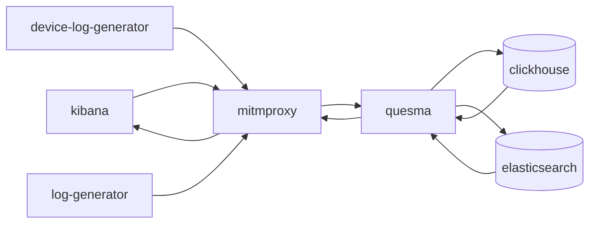

# Development

## Architecture

### Architecture Decision Records

https://github.com/QuesmaOrg/quesma/tree/main/adr

### Quesma

#### L4 Proxy



#### Dual-Write



### Docker Compose Setup (`local-dev`)



### Kibana

Kibana is available at [localhost:5601](http://localhost:5601/app/observability-log-explorer/).

### MITM Proxy
Mitmweb is available at [localhost:8081](http://localhost:8081).

It is a man in the middle inspection tool, please [consult the mitmproxy documentation](https://docs.mitmproxy.org/stable/).

You can enable the Python script by uncommenting `docker-compose.yml` in `services.mitmproxy.run`.

You can further edit it `mitmproxy/request.py`.

Very useful for quick dumps in `mitmproxy/requests`:
```bash
tail -f mitmproxy/requests/logs-X-X.txt
```

Some filters that you might find useful for filtering out noise requests (copy-paste into the `Search` box):
```bash

!/_doc & !security & !metrics & !.kibana_alerting & !_nodes &!kibana_task_manager & !_pit & !_monitoring & !_xpack & !.reporting & !.kibana & !heartbeat & !_aliases & !_field_caps & !_license & !.logs-endpoint & !.fleet- & !traces & !_cluster & !_resolve & !_mapping & !logs-cloud & !.monitoring & !.ds-risk
```
This will also filter out insert requests:
```bash
!/_doc & !security & !metrics & !.kibana_alerting & !_nodes &!kibana_task_manager & !_pit & !_monitoring & !_xpack & !.reporting & !.kibana & !heartbeat & !_aliases & !_field_caps & !_license & !.logs-endpoint & !.fleet- & !traces & !_cluster & !_resolve & !_mapping & !logs-cloud & !.monitoring & !.ds-risk & !_bulk
```

### Memory Profiling
Container-friendly _pprof_ endpoint is exposed at [localhost:9999/debug/pprof/](http://localhost:9999/debug/pprof/)

#### Fetch a memory profile

```bash
curl http://localhost:9999/debug/pprof/heap > heap.out
go tool pprof -http=:8082 heap.out 
````

Now, head over to localhost:8082 and you can inspect the memory profile

### Clickhouse-client
To connect to the client when `clickhouse-server` is running on [localhost:8123/play](http://localhost:8123/play)

Alternatively, you can find the container name using `docker ps` and use the command line, remember to substitute `{container-name}` with the actual name of the container:

```bash
docker exec -it {container-name} clickhouse-client
```

Once you connected, you run typical SQL commands such as:
```sql
SHOW TABLES;
DESCRIBE logs;
SELECT * FROM logs LIMIT 10;
```


### Running locally with debugger

It's possible to run Quesma from IDE with a debugger. For that, you need to start the auxiliary services with the `local-debug.yml` file,
which provides a minimal set of dependencies - Elasticsearch, Clickhouse, and Kibana with sample data sets.

1. Change the name of the `config.yaml.template` file to `config.yaml` or create a new one and copy the content from the template.
2. Navigate to `quesma/main.go` and click `Run application` menu in your IDE. Optionally, you can also run the `main.go` file from the command line.
3. Start auxiliary services with the following command:
    ```bash
    HOST_IP=$(ifconfig en0 | awk '/inet / {print $2}') docker-compose -f docker/local-debug.yml up
    ```
   This is minimalistic setup with `Elasticsearch`, `ClickHouse`, and `Kibana` populated with sample data sets.
   There's also `MITM proxy` to help you inspect the actual traffic.

   **NOTE:** Since we're all using Mac's, Docker daemon cannot use `host` network mode. The only option for processes running
   in containers to connect locally running Quesma process is to pass the IP address like this.
4. If you set proper breakpoints in your IDE, you should see the execution stopped at the breakpoint.
5. Profit!
