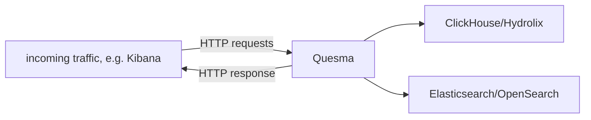

Quesma Early Adopter Preview (EAP) documentation
=================================

Welcome to the Quesma EAP! We're excited to have you on board and can't wait to hear your feedback!
This guide will help you get started.

# What is Quesma?

In its current (EAP) form, Quesma is a lightweight database proxy, enabling database interoperability between
Elasticsearch/OpenSearch and ClickHouse/Hydrolix. 

The high-level architecture is as follows:


Essentially, Quesma speaks Elasticsearch API, while being able to source the data both from Elasticsearch indices and ClickHouse tables behind it.


# Installation

## Prerequisites

Make sure you have the following before proceeding:
1) Credentials to access Quesma Docker container image (`quesma-registry-key.txt`) along with container image name 
2) Elasticsearch/OpenSearch URL with (optionally) required credentials
3) ClickHouse/Hydrolix URL with (optionally) required credentials

## Installation steps 

1) **Ensure you have access to the Quesma container image** \
Quesma is delivered as a Docker container image. Our engineering team will provide you with the necessary credentials and the image name.\
    **Example:** With `quesma-registry-key.txt` file supplied by our team, log into the Quesma Docker registry on your local machine:
    ```shell
    cat quesma-registry-key.txt | docker login -u _json_key_base64 --password-stdin https://europe-central2-docker.pkg.dev
    ```
    Then you can pull the image with `docker pull $IMAGE_NAME`. 
2) **Create configuration file** \
Quesma requires a configuration file to run. User needs to create the configuration file is written in YAML format which will contain settings like data sources, logging configuration, etc. \
Quesma Docker image has to have access to the configuration file, which should be mounted to the container. \
Configuration file location should be specified with `QUESMA_CONFIG_FILE` environment variable.
3) **Run Quesma Docker container** \
Once pulled, the image can run using any container orchestration tool (e.g. Kubernetes) or standalone Docker.\
**Example:** Running Quesma container on the local machine, with configuration file named `my-local-config-file.yml` in current directory:
    ```shell
    docker run -i -t -e QUESMA_CONFIG_FILE=/mnt/config.yaml -v $PWD/my-local-config-file.yml:/mnt/config.yaml  quesma:latest
    ```
    Please refer to `Configuration` section for more details on configuration file syntax.
4) ...

## Software and hardware requirements

We recommend setting up at least 2 CPU cores and 2GBs of RAM for the Quesma container. The actual requirements may vary depending on the workload and the number of concurrent connections.

Quesma has been tested with following software versions:

| Software                         | Version         |
|----------------------------------|-----------------|
| Docker                           | `24.0.7`        | 
| Elasticsearch/Kibana             | `8.11.1`        |
| ClickHouse                       | `24.1`, `23.12` |
| OpenSearch/OpenSearch Dashboards | `2.12.0`        |
| Hydrolix                         | TBD             |


# Configuration

## Preface

Quesma can be configured using dedicated configuration files written in YAML format, which looks like this: 
```yaml
port: 8080
logging:
  disableFileLogging: false
```
Additionally, you can use environment variables which **override** the configuration file settings. Please refer to the `Environment variables` section for more details.

## Full configuration reference 

Quesma container has to have read access to the configuration file, which absolute path should be passed with `QUESMA_CONFIG_FILE` environment variable.
Configuration is being loaded at the start of the service and is **not** being reloaded during runtime. For any changes to take effect, Quesma restart is needed.

### General 
```yaml
port: 8080
ingestStatistics: true
```
`port` is the port number on which Quesma listens for incoming HTTP traffic. `ingestStatistics` is a boolean flag, 
which when set to `true` enables the collection of statistics about the incoming traffic being processed.

### Elasticsearch configuration
```yaml
elasticsearch:
  url: "http://localhost:9200"
  user: "elastic"
  password: "changeme"
  call: false
```
Elasticsearch URL to connect to. Both HTTP and HTTPS are supported. `user` and `password` are optional and are used for supplying HTTP basic auth credentials.
`call` is a boolean flag, which when set to `true`

### ClickHouse configuration
```yaml
clickhouse:
  url: "clickhouse://localhost:9440"
  user: "user"
  password: "changeme"
```
While ClickHouse supports HTTP, only native protocol connection (`clickhouse://`) is supported.
**WARNING** `clickhouse` and `hydrolix` sections are mutually exclusive. Only one data source of this type can be configured.

### Hydrolix configuration
```yaml
hydrolix:
  url: "clickhouse://localhost:9000"
  user: "user"
  password: "changeme"
  database: "dbname"
```
Database name is **required** for Hydrolix connection. Only native ClickHouse protocol connection (`clickhouse://`) is supported.
**WARNING** `clickhouse` and `hydrolix` sections are mutually exclusive. Only one data source of this type can be configured.

### Quesma logging configuration
```yaml
logging:
  path: "/mnt/logs"
  level: "debug"
  disableFileLogging: false
```
By default, Quesma container logs only to stdout. If you want to log to a file, set `disableFileLogging` to `false` and provide a path to the log file.
Make sure the path is writable by the container and is also volume-mounted.

### Index (data source) configuration
@TODO INDEX CONFIG WHICH IS REVAMPED ATM

## Environment variables

Environment variable names are case-sensitive and follow the pattern `QUESMA_<config-key>`, except here delimiter being `_` instead of `.`.

Examples:
* `QUESMA_logging_level=debug` overrides `logging.level` in the config file
* `QUESMA_licenseKey=xyz` overrides `licenseKey` in the config file


# Known limitations or unsupported functionalities

Some of the notable limitations or unsupported functionalities in this version:
* Only querying data is supported, no ingest operations are allowed.
* Quesma does not support all Elasticsearch API endpoints and Query DSL features. Please 
  refer to the `List of supported endpoints` section for more details.
* Quesma does not allow mixed-data source queriese.g. calling `GET /data_a,data_b/_search` where `data_a` is in Elasticsearch and `data_b` is ClickHouse table.
    * For Kibana user, this means that Data View cannot contain multiple indices backed up by different data sources.
    * For Elasticsearch API user, this means that you cannot perform queries like `GET /data_a,data_b/_search`, where `data_a` is in Elasticsearch and `data_b` is ClickHouse table.
* Specific types of aggregation queries are not supported, 
e.g. [pipeline aggregations](https://www.elastic.co/guide/en/elasticsearch/reference/8.11/search-aggregations-pipeline.html) or geo-type aggregations. 

## List of supported endpoints

Quesma supports a subset of Elasticsearch API endpoints. 
Upon a query, Quesma will forward the request to the appropriate data source (Elasticsearch or ClickHouse).
The following endpoints are supported:

* `POST /_search`
* `POST /:index/_search`
* `POST /:index/_async_search`
* `GET  /:index/_count`
* `POST /:index/_field_caps`
* `POST /:index/_terms_enum`
* `GET  /_cluster/health`

**Warning:** Quesma does not support path parameters in URLs listed above. 

## List of supported Kibana features

Quesma allows querying data from Kibana, but not all features are supported.

For querying data, users can use:
* Discover, ref: [Kibana docs](https://www.elastic.co/guide/en/kibana/8.11/discover.html)
* Dashboards, ref: [Kibana docs](https://www.elastic.co/guide/en/kibana/8.11/dashboard.html)

Additional features:
* Alerting (ref: [Kibana docs](https://www.elastic.co/guide/en/kibana/8.11/kibana-alerts.html)) - limited to `Elasticsearch query` (`KQL or Lucene` and `Query DSL`) types


# Miscellaneous

## Feedback and support
In case of any issues, questions or feedback, please reach out to us at `eap-support@quesma.com`.

## Telemetry collection

Quesma collects telemetry data about the usage of the service. This data is used to improve the product and is not shared with any third parties.

Telemetry data consists of:
* Quesma environment information like components versions and runtime stats. Example entry:
  <details>
  
  ```
    {
    "started_at": 1713180071,
    "hostname": "MacBook-Pro.local",
    "quesma_version": "development",
    "instanceId": "438c42a6-fb1a-11ee-bcc4-b66e58b1f280",
    "clickhouse": {
      "status": "ok",
      "number_of_rows": 14725105,
      "disk_space": 17047512,
      "open_connection": 2,
      "max_open_connection": 0,
      "server_version": "23.12.2.59"
    },
    "elasticsearch": {
      "status": "ok",
      "number_of_docs": 0,
      "size": 747,
      "server_version": "8.11.1"
    },
    "clickhouse_queries": {
      "count": 0,
      "avg_time_sec": 0,
      "failed": 12,
      "over_thresholds": {
        "1": 0,
        "10": 0,
        "30": 0,
        "5": 0,
        "60": 0
      },
      "percentiles": {
        "25": 0,
        "5": 0,
        "50": 0,
        "75": 0,
        "95": 0
      }
    },
    "clickhouse_inserts": {
      "count": 0,
      "avg_time_sec": 0,
      "failed": 0,
      "over_thresholds": {
        "1": 0,
        "10": 0,
        "30": 0,
        "5": 0,
        "60": 0
      },
      "percentiles": {
        "25": 0,
        "5": 0,
        "50": 0,
        "75": 0,
        "95": 0
      }
    },
    "elastic_queries": {
      "count": 38,
      "avg_time_sec": 0.002649310236842105,
      "failed": 0,
      "over_thresholds": {
        "1": 0,
        "10": 0,
        "30": 0,
        "5": 0,
        "60": 0
      },
      "percentiles": {
        "25": 0.000872708,
        "5": 0.000657125,
        "50": 0.001412542,
        "75": 0.005473208,
        "95": 0.007779666
      }
    },
    "top_user_agents": [
      "Kibana/8.11.1"
    ],
    "runtime": {
      "memory_used": 8296328,
      "memory_available": 38654705664
    },
    "number_of_panics": 0,
    "report_type": "on-schedule",
    "taken_at": 1713180101
  }
  ```
  </details>
* Quesma logs 


### Appendix A: An example configuration

```yaml
port: 8080
elasticsearch:
  url: "http://localhost:9200"
  user: "elastic"
  password: "changeMe"
clickhouse:
  url: "clickhouse://localhost:9440"
  user: "user"
  password: "changeMe"
#  database: "dbname"           Required only for Hydrolix
ingestStatistics: true
#logging:                       Optional, by default Quesma logs to stdout
#  path: "/var/log/quesma"      Optional, if you want to log to a file 
#  level: "info"                Optional, default is "info"
#  disableFileLogging: false    Optional, default is false
indexes:
  - pattern: "kibana_sample_data_ecommerce"
    enabled: true
  - pattern: "kibana_sample_data_flights"
    enabled: true
  - pattern: "example"
    enabled: false
  - pattern: "kibana_sample_data_logs"
    enabled: true
    aliases:
      timestamp:
        targetfieldname: "timestamp"
        sourcefieldname: "@timestamp"
  - pattern: "device_data"
    enabled: true
    fullTextFields: ["message", "host.name"]
```
