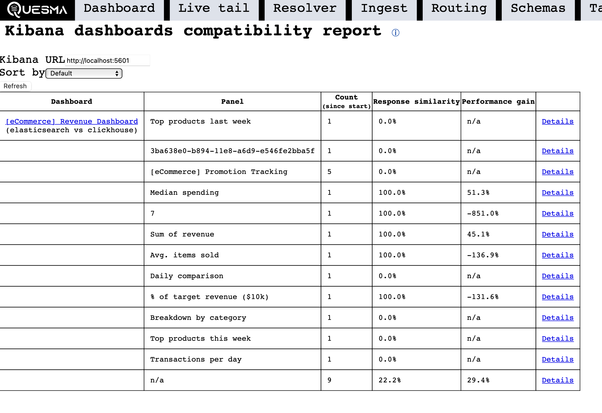

# A/B testing

Quesma can help validate your migration by sending queries to both Elasticsearch and ClickHouse simultaneously and comparing the results. This allows you to verify that queries return equivalent results from both systems before fully switching over.

You can enable A/B testing on an individual index level or for all (unconfigured) indexes via `*`. The configuration supports specifying which source (Elasticsearch or ClickHouse) should be the primary source to return results from and compare to.

Apart from validating correctness, A/B testing also measures the execution time difference (speedups or slowdowns) and generates a report per each dashboard and index.

## Configuration

Enabling A/B testing is as simple as adding two targets to an index:

```yaml
processors:
  - name: my-query-processor
    type: quesma-v1-processor-query
    config:
      indexes:
        kibana_sample_data_ecommerce:
          target: [ backend-elastic, backend-clickhouse ]
```

The order of targets matters in the configuration - the first target will be the primary target that Kibana (or other applications) receives results from. In the example above, Quesma will:

1. Receive an incoming query from Kibana/OpenSearch Dashboards
2. Send the same query to both Elasticsearch and ClickHouse 
3. Compare the responses to ensure they match
4. Return the response from the Elastic to the client
5. Log any discrepancies for analysis

## A/B testing report

In the Quesma managment UI (default port `9999`) the "A/B" tab shows a compatibility report based on the collected data:



Upon clicking on the "Details" link, you can see a more detailed information about the discovered mismatch between sources.