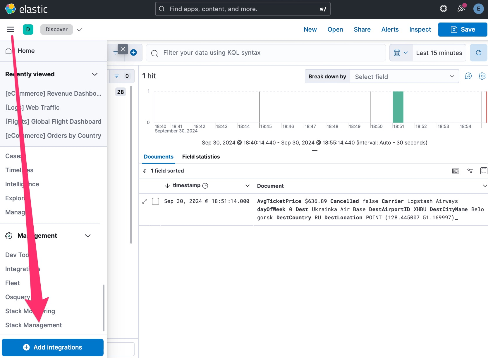
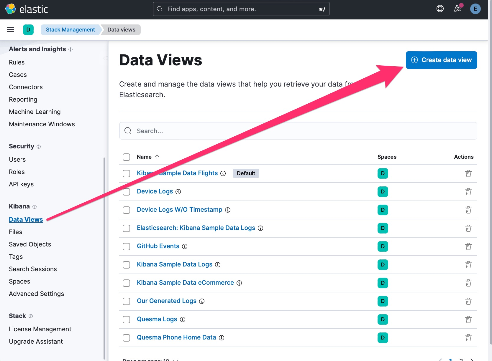
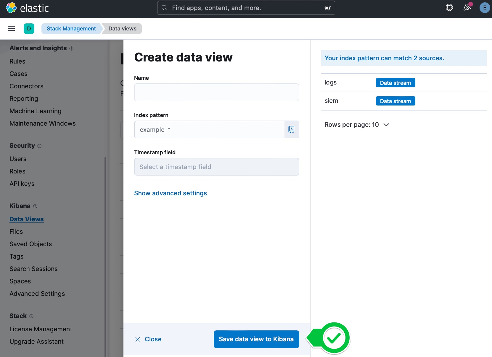
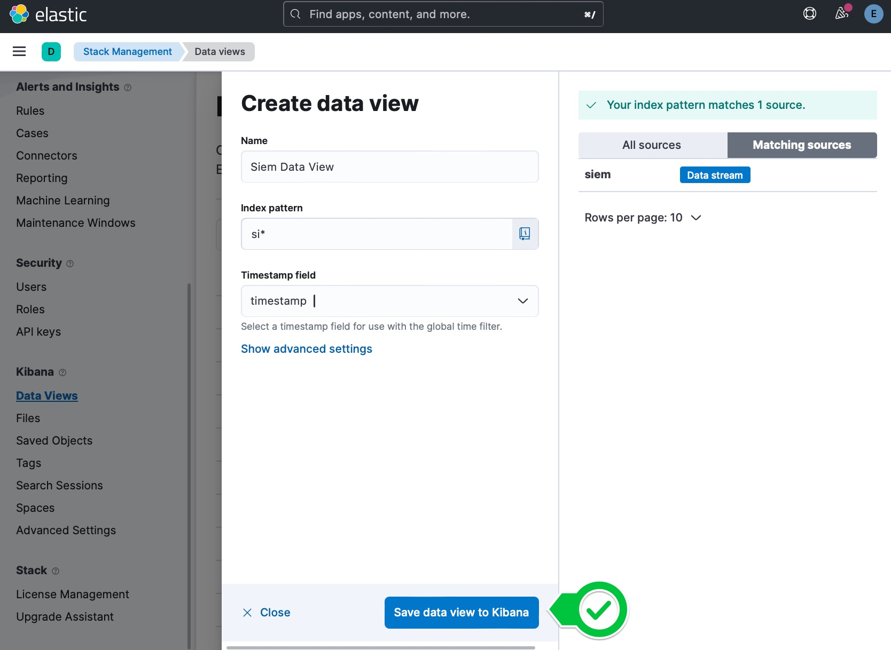
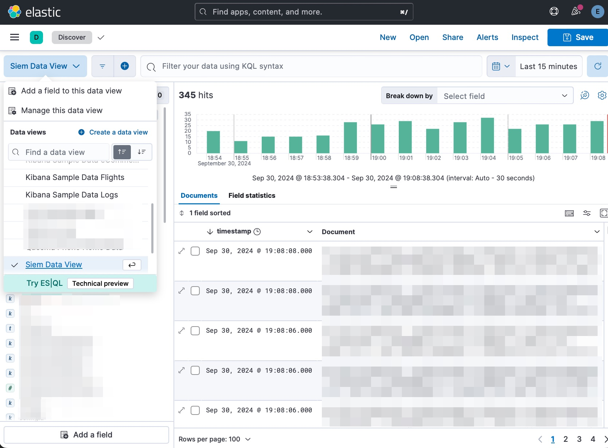

# Data Views creation guide

This guide will help you create Data Views for Hydrolix/ClickHouse tables in Kibana.

1. Open Kibana in your browser and navigate to the **Stack Management** section.
   
2. Select **Data Views** section and click on the **Create data view** button.
   
3. In th **Create data view** dialog, you should already see your tables represented as Elasticsarch Data streams.
   
4. In th **Create data view** form, make sure to fill:
   * Data view name
   * Index pattern, in this case - for `siem` table we'll use `si*`
   * Choose a timestamp field from the dropdown menu (if available - it will enable histogram and time picker in Discover tab)
   
5. Navigate to `Discover` tab, where you should be able to see query your data
   