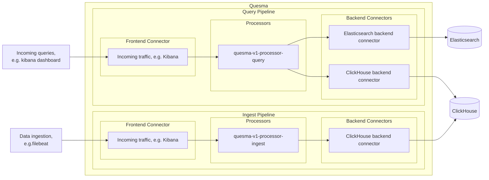

# Configuration primer

## Configuration overview

### Pipelines

Conceptually, Quesma is built as a set of **pipelines** for incoming requests processing. A pipeline consists of:
* **Frontend connector** - responsible for receiving incoming requests and properly responding to them. Frontend
  connectors define the API which Quesma exposes - for example, Elasticsearch REST API.
* **Processors** - responsible for processing incoming data, e.g. translating incoming Elasticsearch Query DSL to SQL.
* **Backend connector** - responsible for sending processed data to the backend. Specific types of backend connectors are required by the processors.

An example diagram of the Quesma architecture, where query pipeline retrieves data from both Elasticsearch and ClikHouse while ingest pipeline sends data to ClickHouse only, is shown below:


### Connectors

#### Frontend connectors

Frontend connector has to have a `name`, `type` and `config` fields.
* `name` is a unique identifier for the connector
* `type` specifies the type of the connector.\
  At this moment, only two frontend connector types are allowed: `elasticsearch-fe-query` and `elasticsearch-fe-ingest`.
* `config` is a set of configuration options for the connector. Specifying `listenPort` is mandatory, as this is the port on which Quesma is going to listen for incoming requests. **Due to current limitations, all frontend connectors have to listen on the same port.**
```yaml
frontendConnectors:
  - name: elastic-ingest
    type: elasticsearch-fe-ingest
    config:
      listenPort: 8080
  - name: elastic-query
    type: elasticsearch-fe-query
    config:
      listenPort: 8080
```

The supported configuration options for frontend connectors (under `config`):
* `listenPort` - port number on which the frontend connector will listen for incoming requests
* `disableAuth` - when set to `true`, disables authentication for incoming requests (optional, defaults to false). If you use Elasticsearch/Kibana without authentication, set it to `true`.


#### Backend connectors

Backend connector has to have a `name`, `type` and `config` fields.
* `name` is a unique identifier for the connector
* `type` specifies the type of the connector.\
  At this moment, only three backend connector types are allowed: `elasticsearch`, `clickhouse` (used for ClickHouse Cloud SaaS service), `clickhouse-os` (self-hosted ClickHouse) and `hydrolix`.
* `config` is a set of configuration options for the connector.
```yaml
backendConnectors:
  - name: my-minimal-elasticsearch
    type: elasticsearch
    config:
      user: "elastic"
      password: "change-me"
      url: "http://192.168.0.7:9200"
  - name: my-clickhouse-data-source
    type: clickhouse-os
    config:
      user: "username"
      password: "username-is-password"
      database: "dbname"
      url: "clickhouse://192.168.0.9:9000"
```

The supported configuration options for backend connectors (under `config`):
* `url` - connection string to the backend service in a URL format (`protocol://host:port`):
  * for Elastic/OpenSearch the expected format is `http://host:port` (Elastic/OpenSearch default port is 9200)
  * for ClickHouse/Hydrolix the expected format is `clickhouse://host:port` (ClickHouse default port is 9000, ClickHouse/Hydrolix default encrypted port is 9440). Note that Quesma supports only the ClickHouse native protocol  (`clickhouse://`) and does not support the HTTP protocol.
* `user` - username for authentication
* `password` - password for authentication 
* `database` - name of the database to connect to. It is optional for ClickHouse, but strictly required for Hydrolix, where it is also referred as "project".
* `clusterName` - name of the ClickHouse cluster (optional). This will be used in the `ON CLUSTER clusterName` clause when Quesma creates tables. Setting this option ensures that the created tables are present on all nodes of the distributed cluster.
* `adminUrl` - URL for administrative operations to render a handy link in Quesma management UI (optional)
* `disableTLS` - when set to true, disables TLS for the connection (optional)

### Processors

At this moment there are three types of processors: `quesma-v1-processor-query`, `quesma-v1-processor-ingest` and `quesma-v1-processor-noop`.

```yaml
processors:
  - name: my-query-processor
    type: quesma-v1-processor-query
    config:
      indexes:
        kibana_sample_data_ecommerce:
          target:
            - backend-clickhouse
          schemaOverrides:
            fields:
              "geoip.location":
                type: geo_point
              "products.product_name":
                type: text
        "*":
          target:
            - backend-elastic
```

To get more specific information on processor configuration, please refer to [Processor configuration](#processor-configuration) section. 

::: info Note
* There's a special kind of processor type - `quesma-v1-processor-noop`. It can be used in both query and ingest pipelines. In conjunction with Elasticsearch frontend and Elasticsearch backend connector, it simply transparently routes the traffic 'as is'.
:::

## Pipeline configuration

Pipeline configuration is an entity linking frontend connectors, processors and backend connectors. Pipeline must also have unique name.
When referring to processors or connectors in the pipeline configuration, use their `name` field.
Currently Quesma only supports configurations with either a single pipeline or two pipelines.

Example:
```yaml
pipelines:
    - name: my-pipeline-elasticsearch-query-clickhouse
      frontendConnectors: [ elastic-query ]
      processors: [ my-query-processor ]
      backendConnectors: [ my-minimal-elasticsearch, my-clickhouse-data-source ]
    - name: my-pipeline-elasticsearch-ingest-to-clickhouse
      frontendConnectors: [ elastic-ingest ]
      processors: [ my-ingest-processor ]
      backendConnectors: [ my-minimal-elasticsearch, my-clickhouse-data-source ]
```

## Processor configuration 

Currently, both `quesma-v1-processor-query` and `quesma-v1-processor-ingest` processors have the same configuration options. `quesma-v1-processor-noop` doesn't have any configuration options.

For query and ingest processors you can configure specific indexes via the `indexes` dictionary:
```yaml
processors:
  - name: my-query-processor
    type: quesma-v1-processor-query
    config:
      indexes:
        kibana_sample_data_logs:
          target:
            - backend-elasticsearch
        kibana_sample_data_ecommerce:
          target:
            - backend-clickhouse
          schemaOverrides:
            fields:
              "geoip.location":
                type: geo_point
        "*": # Always required
          target:
            - backend-elasticsearch
```

### Index configuration

`indexes` configuration is a dictionary of configurations for specific indexes. In the example above, the configuration sets up Quesma's behavior for `kibana_sample_data_logs`, `kibana_sample_data_ecommerce` indexes (visible as Elastic indexes), as well as a mandatory field for the default behavior for all other indexes (`*` entry).

The configuration for an index consists of the following configuration options:
- `target` (required): a list of backend connectors that will handle the request. For example the following configuration in the ingest processor:
   ```yaml
     my_index:
       target:
         - backend-elasticsearch
         - backend-clickhouse
   ```
   will dual write ingest requests to `my_index` to both ElasticSearch and ClickHouse.
   Note that ElasticSearch/OpenSearch is the only supported backend for the `*` entry.
   If no targets are provided (empty `target` list) in the configuration of an index in the ingest processor, ingest for that index will be disabled and incoming data will be dropped.
   For the query processor by specifing multiple targets, [Compatibility report](/compatibility-report.md) will be enabled. See [Compatibility report documentation](/compatibility-report.md) for more details.
   
   Some backend connectors have additional attributes which may be used. For example the following configuration sets `useCommonTable` for `backend-clickhouse` target:
   ```yaml
      my_index:
        target:
          - backend-clickhouse:
              useCommonTable: true
   ```
   Currently only the ClickHouse backend connector supports the following attributes:
     - `useCommonTable` (optional): if enabled, Quesma will store data in a single Hydrolix/ClickHouse table named `quesma_common_table`. See [ingest documentation](/ingest.md) for more details.
     - `tableName` (optional): override the name of table in Hydrolix/ClickHouse (by default Quesma uses the same table name as the index name)
- `schemaOverrides` (optional): manual overrides of schema information for an index. Quesma infers schema for an index based on the data ingested and the schema information fetched from ClickHouse. `schemaOverrides` allows you to override this inferred schema with for some fields. For example the following configuration:
    ```yaml
      my_index:
        target:
          - backend-clickhouse
        schemaOverrides:
          "product_name":
            type: "text"
    ```
    changes the type of `product_name` field to `text`. Note: `schemaOverrides` are currently not supported in `*` configuration.

## Optional configuration options

### Quesma licensing configuration

In order to be able to use `hydrolix` or `clickhouse` backend connectors Quesma requires a commercial license key (supplied in the `licenseKey` field of the configuration file). 
Contact us at support@quesma.com if you need one.
```yaml
licenseKey: ZXlKcGJuTjBZV3hz...
```  

### Quesma logging configuration
```yaml
logging:
  path: "/mnt/logs"
  level: "debug"
  disableFileLogging: false
```
By default, Quesma container logs only to stdout. If you want to log to a file, set `disableFileLogging` to `false` and provide a path to the log file.
Make sure the path is writable by the container and is also volume-mounted.
