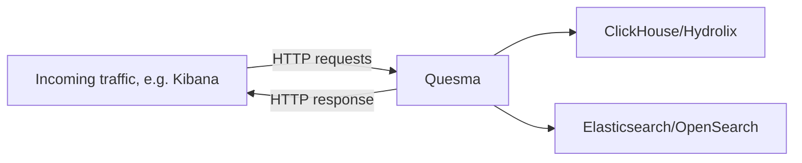

# What is Quesma?

Quesma is an actively developed database gateway. Route your queries through a translation layer that seamlessly connects your apps with the modern database platforms of your choice. No more query refactoring during migrations.

In its current form, Quesma is a lightweight database proxy that enables database interoperability between Elasticsearch/OpenSearch and ClickHouse/Hydrolix.

The high-level architecture is as follows:

Essentially, Quesma speaks Elasticsearch API and can source data from both Elasticsearch indices and [ClickHouse](https://clickhouse.com) or [Hydrolix](https://hydrolix.io) tables.

## Quick start demo

The easiest way to get try out Quesma is to run the example `docker-compose` setup, which includes sample data and is pre-configured with example datasets. 
\
See the [Quick start demo](./quick-start.md) for more details.

## Installation guide

For those interested in deploying Quesma in their existing environments, follow along to **Installation guide** section, which  provides a detailed instructions on how to set up Quesma in various deployment scenarios.
\
See the [Installation guide](./installation.md) for more details.
