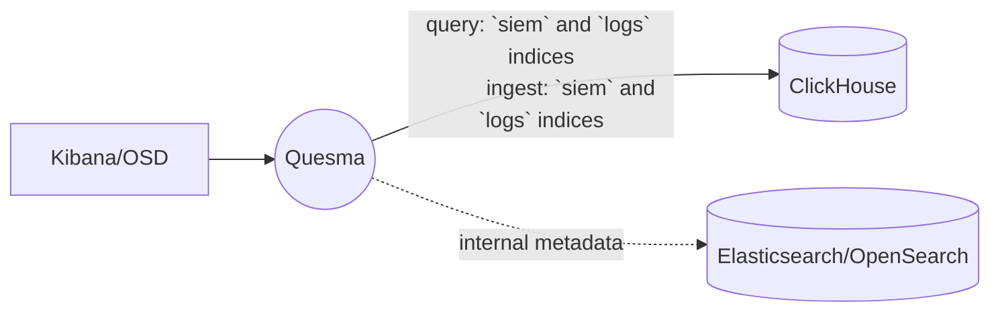

# Query ClickHouse/Hydrolix tables as Elasticsearch indices

::: warning
Note: If you are using Hydrolix as your data source please follow to [Query Hydrolix tables as Elasticsearch indices](./example-2-0.md) subsection of this document for more information. If you plan to use ClickHouse, continue below.
:::


In this scenario, user's only data source is ClickHouse, which contains two tables named `logs` and `siem`.
Quesma is configured to expose ClickHouse tables via Elasticsearch API, making them visible in Kibana/OpenSearch Dashboard (OSD) as Elasticsearch indices and also to ingest data to these two tables in ClickHouse only.

If you are interesed in more details about ingesting your data, refer to [Ingest](/ingest.md) page.

::: info Note
In this approach, Quesma still requires a minimal Elasticsearch/OpenSearch cluster for:
* storing Kibana/OSD metadata
* storing user data and authentication (unless its explicitly disabled)
* storing any additional indexes appearing at ingest endpoint and not explicitely listed in Quesma ingest processor
:::

Architecture diagram:


### Quesma installation

**Prerequisites:**
* ClickHouse is running.
* Kibana/OSD and minimal instance of Elasticsearch/OpenSearch are running.
* [Docker is installed](https://www.docker.com/get-started/), at least 20.10 version.


**Installation steps:**

1. Create a configuration file named `quesma.yaml` with the following content, make sure to replace placeholders (`#PLACE_YOUR*`) with actual values.
    ```yaml
    licenseKey: #PLACE_YOUR_LICENSE_KEY_HERE 
    # license key is required for backend connector of `clickhouse` type, 
    # please contact Quesma support (support@quesma.com) to obtain yours
    # in case you are using self-hosted clickhouse instance, you can use `clickhouse-os` backend connector and continue without the license key  
    frontendConnectors:
      - name: elastic-query
        type: elasticsearch-fe-query
        config:
          listenPort: 8080
     - name: elastic-ingest
        type: elasticsearch-fe-ingest
        config:
          listenPort: 8080
    backendConnectors:
      - name: minimal-elasticsearch
        type: elasticsearch
        config:
          url: #PLACE_YOUR_ELASTICSEARCH_URL_HERE, for example: http://192.168.0.7:9200
          user: #PLACE_YOUR_ELASTICSEARCH_USERNAME_HERE
          password: #PLACE_YOUR_ELASTICSEARCH_PASSWORD_HERE
      - name: clickhouse-instance
        type: clickhouse-os
        #type: clickhouse # use for ClickHouse cloud service only
        config:
          url: #PLACE_YOUR_CLICKHOUSE_URL_HERE, for example: clickhouse://192.168.0.7:9000
          user: #PLACE_YOUR_CLICKHOUSE_USER_HERE
          password: #PLACE_YOUR_CLICKHOUSE_PASSWORD_HERE
          database: #PLACE_YOUR_CLICKHOUSE_DATABASE_NAME_HERE
    processors:
      - name: query-processor
        type: quesma-v1-processor-query
        config:
          indexes:      # `siem` and `logs` are just examples, 
            siem:       # make sure to replace them with your actual table names in your ClickHouse instance
              target: [ clickhouse-instance ]
            logs:
              target: [ clickhouse-instance ]
            '*':        # DO NOT remove, always required
              target: [ minimal-elasticsearch ]
      - name: ingest-processor
        type: quesma-v1-processor-ingest
        config:
          indexes:      # `siem` and `logs` are just examples, 
            siem:       # make sure to replace them with your actual table or index names in your ClickHouse instance
              target: [ clickhouse-instance ]
            logs:
              target: [ clickhouse-instance ]
            '*':        # DO NOT remove, always required
              target: [ minimal-elasticsearch ]  
    pipelines:
      - name: elasticsearch-proxy-read
        frontendConnectors: [ elastic-query ]
        processors: [ query-processor ]
        backendConnectors: [ minimal-elasticsearch, clickhouse-instance ]
     - name: elasticsearch-proxy-write # remove if you do NOT want to write data to ClickHouse
        frontendConnectors: [ elastic-ingest ]
        processors: [ ingest-processor ]
        backendConnectors: [ minimal-elasticsearch, clickhouse-instance ]
    ```
> Note: To learn more about configuration options, refer to [Configuration primer](/config-primer.md)
    
2. Run Quesma with the following command:
    ```bash
    docker run --name quesma -p 8080:8080 \
     -e QUESMA_CONFIG_FILE=/configuration/quesma.yaml \
    -v $(pwd)/quesma.yaml:/configuration/quesma.yaml quesma/quesma:latest 
    ```
   You have now a running Quesma instance running  with Elasticsearch API endpoint on port 8080. You can also enable Quesma's admin panel at [localhost:9999](http://localhost:9999/) by adding `-p 9999:9999` to docker run command.

3. Reconfigure client endpoint:
   * For Kibana: update your [Kibana configuration](https://www.elastic.co/guide/en/kibana/current/settings.html), so that it points to Quesma Elasticsearch API endpoint mentioned above, instead of Elasticsearch original endpoint. In your Kibana configuration file, replace the `elasticsearch.hosts` value with Quesma's host and port, e.g.:
    ```yaml
    elasticsearch.hosts: ["http://quesma:8080"]
    ```
   or optionally using `ELASTICSEARCH_HOSTS` environment variable.
   * For OpenSearchDashboards: modify [`opensearch_dashboards.yml` file](https://opensearch.org/docs/latest/install-and-configure/configuring-dashboards/) and change `opensearch.hosts` property.
   Also, make sure to update the Elasticsearch/OpenSearch endpoint configuration for any clients ingesting data.
5. Restart Kibana/OSD.
6. Add DataViews/Index Patterns:
   * For Kibana: in order to view your ClickHouse tables in Kibana, you need to create **Data Views** for tables (indexes) from the config. If you're unsure how to do it, follow the [Data Views creation guide](./adding-kibana-dataviews.md) for more information.
   * For OpenSearchDashboards: you may need to add **Index Patterns**. See [instructions](https://opensearch.org/docs/latest/dashboards/management/index-patterns/).
