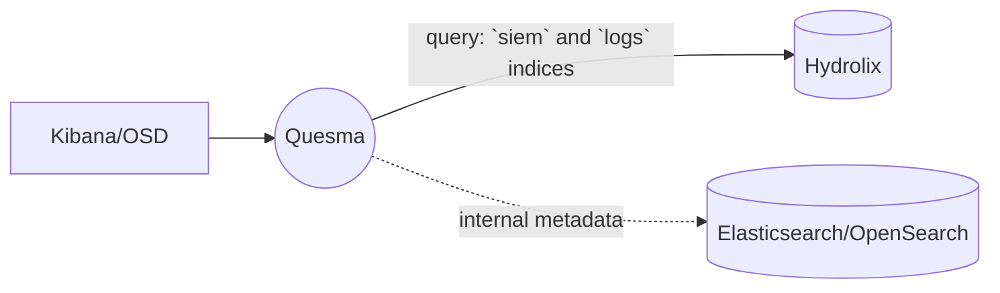

# Query Hydrolix tables as Elasticsearch indices

In this scenario, user's only data source is Hydrolix, which contains two tables named `logs` and `siem`.
Quesma is configured to expose Hydrolix tables via Elasticsearch API, making them visible in Kibana/OpenSearch Dashboard (OSD) as Elasticsearch indices.
Note: ingest to Hydrolix is currently not supported, [let us know](https://quesma.com/contact) if you are interested in this functionality.

::: info Note
In this approach, we require a minimal Elasticsearch/OpenSearch cluster for:
* storing Kibana/OSD metadata
* storing user data and authentication (unless its explicitly disabled)
:::

Architecture diagram:


### Quesma installation

**Prerequisites:**
* Hydrolix is running.
* Kibana/OSD and Elasticsearch/OpenSearch are running.
* [Docker is installed](https://www.docker.com/get-started/), at least 20.10 version.


**Installation steps:**

1. Create a configuration file named `quesma.yaml` with the following content, make sure to replace placeholders (`#PLACE_YOUR*`) with actual values.
    ```yaml
    licenseKey: #PLACE_YOUR_LICENSE_KEY_HERE 
    # license key is required for backend connector of `hydrolix` type, 
    # please contact Quesma support (support@quesma.com) to obtain yours  
    frontendConnectors:
      - name: elastic-query
        type: elasticsearch-fe-query
        config:
          listenPort: 8080
    backendConnectors:
      - name: minimal-elasticsearch
        type: elasticsearch
        config:
          url: #PLACE_YOUR_ELASTICSEARCH_URL_HERE, for example: http://192.168.0.7:9200
          user: #PLACE_YOUR_ELASTICSEARCH_USERNAME_HERE
          password: #PLACE_YOUR_ELASTICSEARCH_PASSWORD_HERE
      - name: hydrolix-instance
        type: hydrolix
        config:
          url: #PLACE_YOUR_HYDROLIX_URL_HERE, for example: clickhouse://companyname.hydrolix.live:9440
          user: #PLACE_YOUR_HYDROLIX_USER_HERE
          password: #PLACE_YOUR_HYDROLIX_PASSWORD_HERE
          database: #PLACE_YOUR_HYDROLIX_DATABASE_NAME_HERE
    processors:
      - name: query-processor
        type: quesma-v1-processor-query
        config:
          indexes:      # `siem` and `logs` are just examples, 
            siem:       # make sure to replace them with your actual table names in your Hydrolix instance
              target: [ hydrolix-instance ]
            logs:
              target: [ hydrolix-instance ]
            '*':       # DO NOT remove, always required
              target: [ minimal-elasticsearch ]
    pipelines:
      - name: elasticsearch-proxy-read
        frontendConnectors: [ elastic-query ]
        processors: [ query-processor ]
        backendConnectors: [ minimal-elasticsearch, hydrolix-instance ]
    ```
> Note: To learn more about configuration options, refer to [Configuration primer](/config-primer.md)
    
2. Run Quesma with the following command:
    ```bash
    docker run --name quesma -p 8080:8080 \
     -e QUESMA_CONFIG_FILE=/configuration/quesma.yaml \
    -v $(pwd)/quesma.yaml:/configuration/quesma.yaml quesma/quesma:latest 
    ```
   You have now a running Quesma instance running  with Elasticsearch API endpoint on port 8080. You can also enable Quesma's admin panel at [localhost:9999](http://localhost:9999/) by adding `-p 9999:9999` to docker run command.
3. Reconfigure client endpoint:
   * For Kibana: update your [Kibana configuration](https://www.elastic.co/guide/en/kibana/current/settings.html), so that it points to Quesma Elasticsearch API endpoint mentioned above, instead of Elasticsearch original endpoint. In your Kibana configuration file, replace the `elasticsearch.hosts` value with Quesma's host and port, e.g.:
       ```yaml
      elasticsearch.hosts: ["http://quesma:8080"]
      ```
      or optionally using `ELASTICSEARCH_HOSTS` environment variable.

      If you use Elasticsearch/Kibana without authentication, please modify the `frontendConnectors` section in the following way:
      ```yaml
      frontendConnectors:
        - name: elastic-query
          type: elasticsearch-fe-query
          config:
            listenPort: 8080
            disableAuth: true
        - name: elastic-ingest
          type: elasticsearch-fe-ingest
          config:
            listenPort: 8080
            disableAuth: true
      ```
   * For OpenSearchDashboards: modify [`opensearch_dashboards.yml` file](https://opensearch.org/docs/latest/install-and-configure/configuring-dashboards/) and change `opensearch.hosts` property.
   Also, make sure to update the Elasticsearch/OpenSearch endpoint configuration for any clients ingesting data.

     If you use OpenSearch/OpenSearchDashboards without authentication, please modify the `frontendConnectors` section in the following way:
      ```yaml
      frontendConnectors:
        - name: elastic-query
          type: elasticsearch-fe-query
          config:
            listenPort: 8080
            disableAuth: true
        - name: elastic-ingest
          type: elasticsearch-fe-ingest
          config:
            listenPort: 8080
            disableAuth: true
      ```
4. Restart Kibana/OSD.
5. Add DataViews/Index Patterns:
   * For Kibana: in order to view your Hydrolix tables in Kibana, you need to create **Data Views** for tables (indexes) from the config. If you're unsure how to do it, follow the [Data Views creation guide](./adding-kibana-dataviews.md) for more information.
   * For OpenSearchDashboards: you may need to add **Index Patterns**. See [instructions](https://opensearch.org/docs/latest/dashboards/management/index-patterns/).
