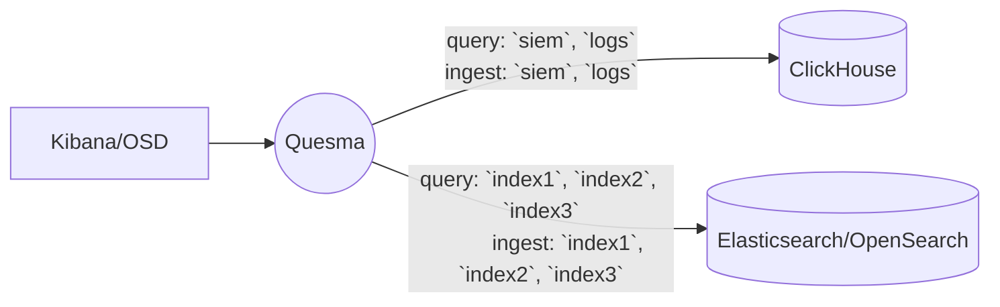

# Adding ClickHouse/Hydrolix tables to existing Kibana/Elasticsearch ecosystem

::: warning
If you are using Hydrolix as your data source please follow to [Adding Hydrolix tables to existing Kibana/Elasticsearch ecosystem](./example-2-1-hydro-specific.md) subsection of this document for more information. If you plan to use ClickHouse, continue below.
:::

In this scenario, user already has data in Elasticsearch/OpenSearch indices - let's assume `index1`, `index2` and `index3`.
Additionally, they have a ClickHouse instance with tables named `siem` and `logs`.

Quesma is configured to expose both ClickHouse tables via its Elasticsearch API, making them visible in Kibana/OpenSearchDashboards (OSD) as Elasticsearch indices.
Quesma also supports ingesting data via Elasticsearch-compatible API (e.g. `_bulk`/`_doc` endpoint) to:
* Both ClickHouse tables, by translating incoming Elasticsearch POST requests targeting `siem`/`logs` indices to ClickHouse INSERT queries.
* Existing Elasticsearch/OpenSearch indices (`index1`, `index2` and `index3`) by relaying traffic directly to the original Elasticsearch/OpenSearch instance.

If you are interesed in more details about ingesting your data, refer to [Ingest](/ingest.md) page.



### Quesma installation

**Prerequisites:**
* ClickHouse is running.
* Kibana/OSD and Elasticsearch/OpenSearch are running.
* [Docker is installed](https://www.docker.com/get-started/), at least 20.10 version.

**Installation steps:**

1. Create a configuration file named `quesma.yaml` with the following content, make sure to replace placeholders (`#PLACE_YOUR*`) with actual values.
    ```yaml
    licenseKey: #PLACE_YOUR_LICENSE_KEY_HERE 
    # license key is required for backend connector of `clickhouse` type, 
    # please contact Quesma support (support@quesma.com) to obtain yours
    # in case you are using self-hosted clickhouse instance, you can use `clickhouse-os` backend connector and continue without the license key  
    frontendConnectors:
      - name: elastic-query
        type: elasticsearch-fe-query
        config:
          listenPort: 8080
      - name: elastic-ingest
        type: elasticsearch-fe-ingest
        config:
          listenPort: 8080
    backendConnectors:
      - name: elasticsearch-instance
        type: elasticsearch
        config:
          url: #PLACE_YOUR_ELASTICSEARCH_URL_HERE, for example: http://192.168.0.7:9200
          user: #PLACE_YOUR_ELASTICSEARCH_USERNAME_HERE
          password: #PLACE_YOUR_ELASTICSEARCH_PASSWORD_HERE
      - name: clickhouse-instance
        type: clickhouse-os
        #type: clickhouse # use for ClickHouse cloud service only
        config:
          url: #PLACE_YOUR_CLICKHOUSE_URL_HERE, for example: clickhouse://192.168.0.7:9000
          user: #PLACE_YOUR_CLICKHOUSE_USER_HERE
          password: #PLACE_YOUR_CLICKHOUSE_PASSWORD_HERE
          database: #PLACE_YOUR_CLICKHOUSE_DATABASE_NAME_HERE
    processors:
      - name: query-processor
        type: quesma-v1-processor-query
        config:
          indexes:  # the list below is just an example, 
            siem:   # make sure to replace them with your actual table or index names
              target:
                - clickhouse-instance
            logs:
              target:
                - clickhouse-instance
            index1:
              target:
                - elasticsearch-instance
            index2:
              target:
                - elasticsearch-instance
            index3:
              target:
                - elasticsearch-instance
            '*':       # DO NOT remove, always required
              target:
                - elasticsearch-instance     
      - name: ingest-processor
        type: quesma-v1-processor-ingest
        config:
          indexes:  # the list below is just an example, 
            siem:   # make sure to replace them with your actual table or index names
              target:
                - clickhouse-instance
            logs:
              target:
                - clickhouse-instance
            index1:
              target:
                - elasticsearch-instance
            index2:
              target:
                - elasticsearch-instance
            index3:
              target:
                - elasticsearch-instance
            '*':       # DO NOT remove, always required
              target:
                - elasticsearch-instance              
    pipelines:
      - name: elasticsearch-proxy-read
        frontendConnectors: [ elastic-query ]
        processors: [ query-processor ]
        backendConnectors: [ elasticsearch-instance, clickhouse-instance ]
      - name: elasticsearch-proxy-write # remove if you do NOT want to write data to Elasticsearch nor ClickHouse
        frontendConnectors: [ elastic-ingest ]
        processors: [ ingest-processor ]
        backendConnectors: [ elasticsearch-instance, clickhouse-instance ]
    ```
> Note: To learn more about configuration options, refer to [Configuration primer](/config-primer.md)
    
2. Run Quesma with the following command:
    ```bash
    docker run --name quesma -p 8080:8080 \
     -e QUESMA_CONFIG_FILE=/configuration/quesma.yaml \
    -v $(pwd)/quesma.yaml:/configuration/quesma.yaml quesma/quesma:latest 
    ```
   You have now a running Quesma instance running  with Elasticsearch API endpoint on port 8080. You can also enable Quesma's admin panel at [localhost:9999](http://localhost:9999/) by adding `-p 9999:9999` to docker run command.
3. Reconfigure client endpoint:
   * For Kibana: update your [Kibana configuration](https://www.elastic.co/guide/en/kibana/current/settings.html), so that it points to Quesma Elasticsearch API endpoint mentioned above, instead of Elasticsearch original endpoint. In your Kibana configuration file, replace the `elasticsearch.hosts` value with Quesma's host and port, e.g.:
      ```yaml
      elasticsearch.hosts: ["http://quesma:8080"]
      ```
      or optionally using `ELASTICSEARCH_HOSTS` environment variable.

      If you use Elasticsearch/Kibana without authentication, please modify the `frontendConnectors` section in the following way:
      ```yaml
      frontendConnectors:
        - name: elastic-query
          type: elasticsearch-fe-query
          config:
            listenPort: 8080
            disableAuth: true
        - name: elastic-ingest
          type: elasticsearch-fe-ingest
          config:
            listenPort: 8080
            disableAuth: true
      ```
   * For OpenSearchDashboards: modify [`opensearch_dashboards.yml` file](https://opensearch.org/docs/latest/install-and-configure/configuring-dashboards/) and change `opensearch.hosts` property.
   Also, make sure to update the Elasticsearch/OpenSearch endpoint configuration for any clients ingesting data.

      If you use OpenSearch/OpenSearchDashboards without authentication, please modify the `frontendConnectors` section in the following way:
      ```yaml
      frontendConnectors:
        - name: elastic-query
          type: elasticsearch-fe-query
          config:
            listenPort: 8080
            disableAuth: true
        - name: elastic-ingest
          type: elasticsearch-fe-ingest
          config:
            listenPort: 8080
            disableAuth: true
      ```
4. Restart Kibana/OSD.
5. Add DataViews/Index Patterns:
   * For Kibana: in order to view your ClickHouse tables in Kibana, you need to create **Data Views** for tables (indexes) from the config. If you're unsure how to do it, follow the [Data Views creation guide](./adding-kibana-dataviews.md) for more information.
   * For OpenSearchDashboards: you may need to add **Index Patterns**. See [instructions](https://opensearch.org/docs/latest/dashboards/management/index-patterns/).
