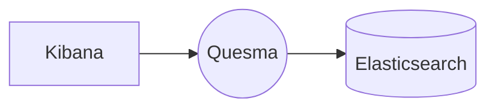

# Transparent Elasticsearch pipeline

In this scenario, we configure a query pipeline to read from Elasticsearch and an ingest pipeline to write to Elasticsearch. The pipelines use the `quesma-v1-processor-noop`, which acts as a transparent proxy so the traffic is not changed whatsoever.



Relevant Quesma configuration fragment:
```yaml
processors:
    - name: noop-query-processor
    type: quesma-v1-processor-noop
pipelines:
    - name: my-elasticsearch-proxy-read
    frontendConnectors: [ elastic-query ]
    processors: [ noop-query-processor ]
    backendConnectors: [ my-minimal-elasticsearch ]
    - name: my-elasticsearch-proxy-write
    frontendConnectors: [ elastic-ingest ]
    processors: [ noop-query-processor ]
    backendConnectors: [ my-minimal-elasticsearch ]
```