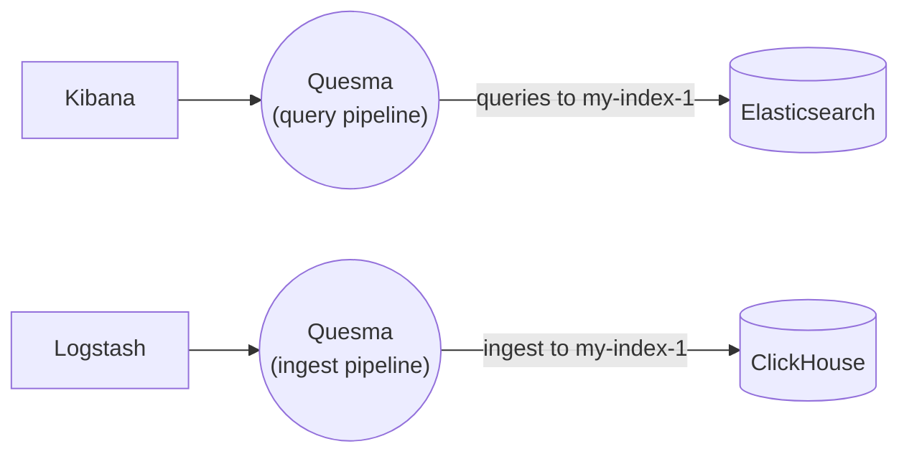

# Reading from Elasticsearch and dual writing to Elasticsearch and ClickHouse

In this scenario, we configure a query pipeline to read from Elasticsearch for index `my-index-1` and an ingest pipeline to write to both Elasticsearch and ClickHouse for index `my-index-1`.



Note that for both pipelines we need to connect the ElasticSearch backend connector that's used for all internal Kibana queries.

Relevant Quesma configuration fragment:
```yaml
processors:
  - name: a-query-processor
    type: quesma-v1-processor-query
    config:
      indexes:
        "my-index-1":
          target: [ my-minimal-elasticsearch ]
  - name: a-ingest-processor
    type: quesma-v1-processor-ingest
    config:
      indexes:
        "my-index-1":
          target: [ my-clickhouse-data-source, my-minimal-elasticsearch ]
pipelines:
  - name: my-elasticsearch-read
    frontendConnectors: [ elastic-query ]
    processors: [ a-query-processor ]
    backendConnectors: [ my-minimal-elasticsearch, my-clickhouse-data-source ]
  - name: my-dual-write
    frontendConnectors: [ elastic-ingest ]
    processors: [ a-ingest-processor ]
    backendConnectors: [ my-minimal-elasticsearch, my-clickhouse-data-source ]    
```
