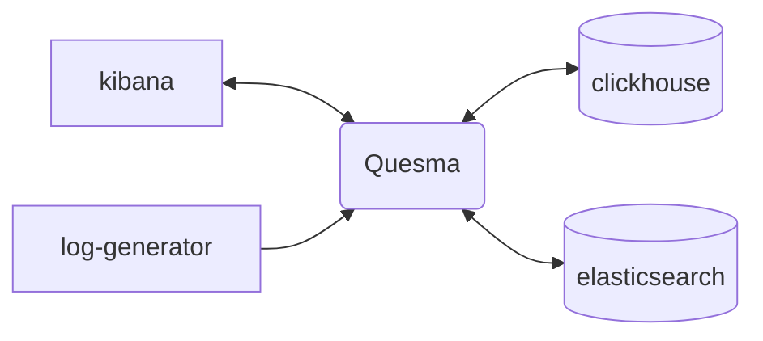

# Quick start demo

The easiest way to get started is to try out the example `docker-compose` setup, which can be found in `/examples/kibana-sample-data.` It features Kibana connecting to Elasticsearch and Clickhouse through Quesma:



The setup contains following demo datasets:
- `logs-generic-default` - generated by `log-generator` application
- `kibana_sample_data_ecommerce` - an official Kibana sample data set of an eCommerce application
- `kibana_sample_data_flights` - an official Kibana sample data set of flights

## Running the demo
In order to run it, you need to:
- clone this repository: `git clone https://github.com/QuesmaOrg/quesma.git`
- run `docker-compose up` directly from `examples/kibana-sample-data` directory

Handy one-liner for above commands:
```bash
git clone https://github.com/QuesmaOrg/quesma.git && docker compose -f quesma/examples/kibana-sample-data/docker-compose.yml up
```

Once it's running, you can access:
- Kibana at [localhost:5601](http://localhost:5601/)
- Quesma at [localhost:9999](http://localhost:9999/)
- Clickhouse at [localhost:8123/play](http://localhost:8123/play)

You can browse the following demo datasets:
- `logs-generic-default` - generated by `log-generator` application
    - Logs Explorer: [link](http://localhost:5601/app/observability-log-explorer)
- `kibana_sample_data_ecommerce` - an official Kibana sample data set
    - Logs Explorer: [link](<http://localhost:5601/app/discover#/?_a=(columns:!(),filters:!(),index:ff959d40-b880-11e8-a6d9-e546fe2bba5f,interval:auto,query:(language:kuery,query:''),sort:!(!(order_date,desc)))&_g=(filters:!(),refreshInterval:(pause:!t,value:60000),time:(from:now-30d%2Fd,to:now))>)
    - Dashboard: [link](<http://localhost:5601/app/dashboards#/view/722b74f0-b882-11e8-a6d9-e546fe2bba5f?_g=(filters:!(),refreshInterval:(pause:!t,value:0),time:(from:now-7d,to:now))>)
- `kibana_sample_data_flights` - an official Kibana sample data set
    - Logs Explorer: [link](<http://localhost:5601/app/discover#/?_a=(columns:!(),filters:!(),index:d3d7af60-4c81-11e8-b3d7-01146121b73d,interval:auto,query:(language:kuery,query:''),sort:!(!(timestamp,desc)))&_g=(filters:!(),refreshInterval:(pause:!t,value:60000),time:(from:now-30d%2Fd,to:now))>)
    - Dashboard: [link](<http://localhost:5601/app/dashboards#/view/7adfa750-4c81-11e8-b3d7-01146121b73d?_g=(filters:!(),refreshInterval:(pause:!t,value:0),time:(from:now-7d,to:now))>)