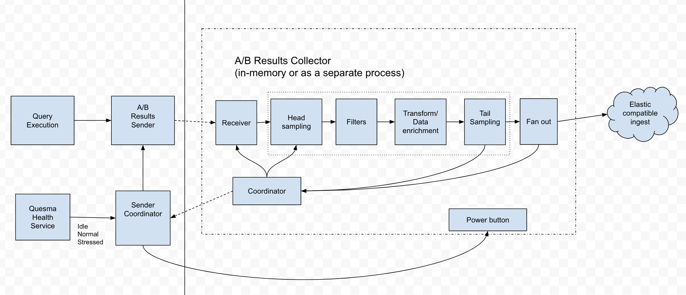

A/B Testing
---

This package contains the code for A/B testing in Quesma. We aim to enable testing of different request processing paths and to compare their results.

Currently, we want to compare the results of:
- Quesma vs. Elasticsearch (using the same data)
- Internal pipelines (main and alternative implementations of query translation)

Architecture
---

Requirements
---

1. A/B testing is an optional feature in Quesma. It must not interfere with the main functionality of the system and can be disabled if necessary.
2. TBD

