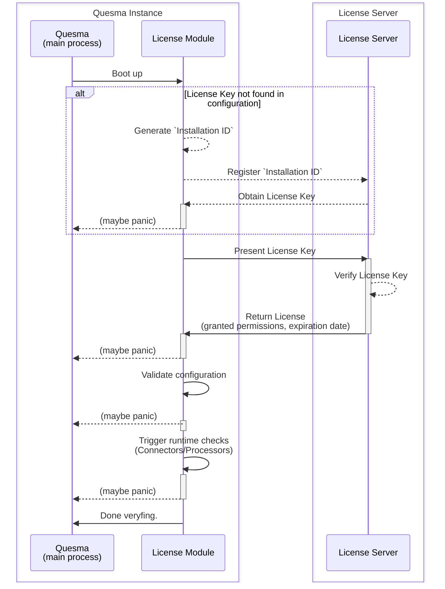

Quesma Licensing Module
=======================

The diagram below illustrates the interaction between the Quesma Licensing Module and the License Server.

## Key assumptions 

* Unless provided explicitly, License Module is going to generate unique `Installation ID` in the form of UUID.
* Aforementioned `Installation ID` is going to be used to identify the Quesma installation, so ideally it has to persist between restarts. \
  We are going to attempt writing it to a file, next to the configuration. This will cover local build use case. 
  If we fail writing it, we are going to regenerate it on each boot (this probably implies cloud deployment situation). 
* License Module is going to use `Installation ID` to **obtain the License Key** from the License Server (unless the License Key is **not** specified in the configuration)
* Quesma License is going to be signed by us and will contain expiration date.
* License Module is going to contact license server and ask for what it's eligible to based on the License Key.
* Based on the that information License Module is going to validate the configuration.
* License Module is going to trigger local checks (usage of allowed processors/connectors).
  Those checks are going to be part of respective components.
